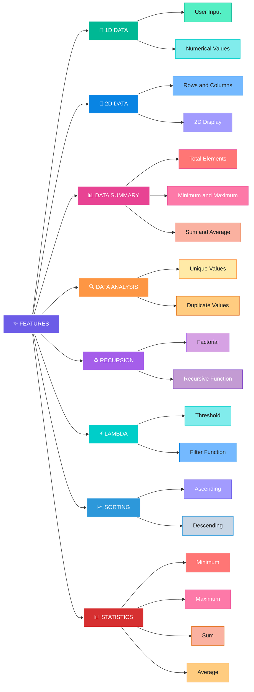
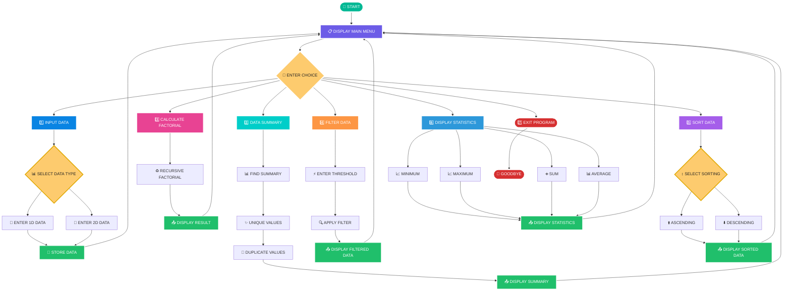
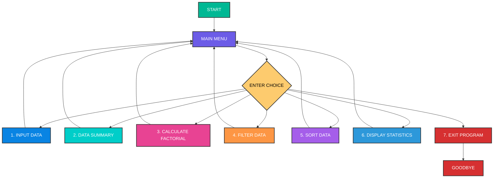
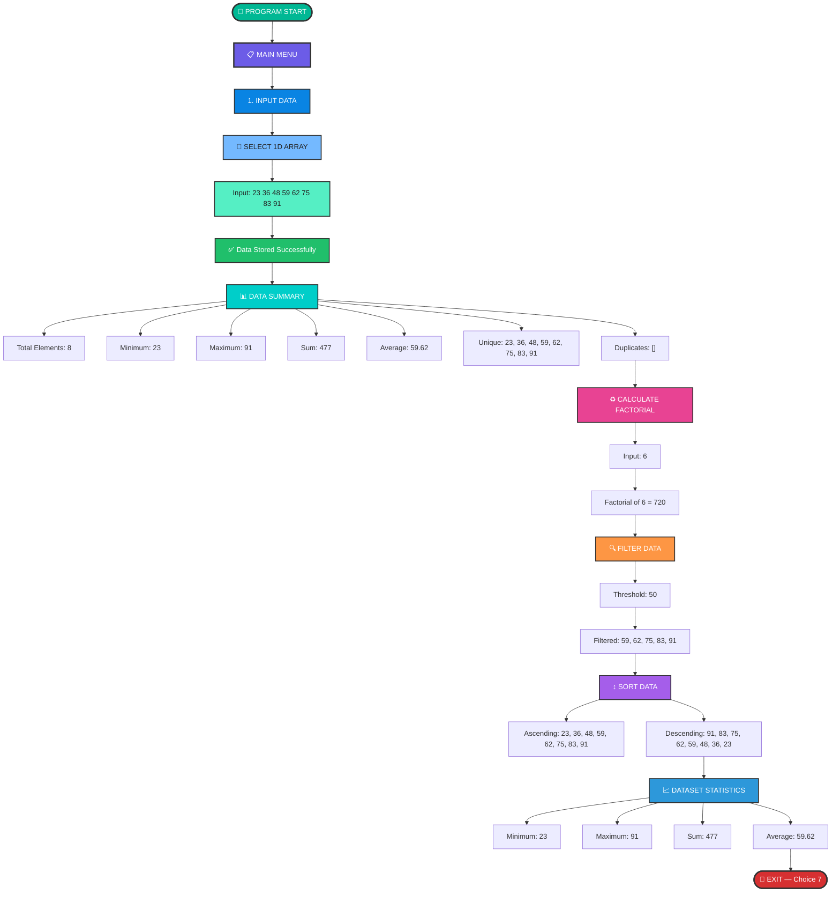

🐍📊 FUNCTIONAL-TREAT

  
  
  
  
  

💻 Learn • Analyze • Transform • Practice

⸻

📖 Overview

functional-treat is a beginner-friendly Python console application designed to practice different Python programming concepts through numerical data processing.

The program allows the user to enter both 1D and 2D data and perform different operations such as calculating data summaries, finding unique and duplicate values, calculating factorial using recursion, filtering data using lambda functions, sorting data, and displaying dataset statistics.

This project brings multiple Python concepts together into one interactive, menu-driven application.

# ✨ Features

This project combines multiple Python features in one interactive application.

---

# 🔄 Program Flow

## 📋 Main Menu Flowchart

## 🖥️ Sample Output — 1D Array

## 🧩 Concepts & Their Purpose

| 🔹 Concept | 🎯 Purpose |
|---|---|
| 📦 **1D & 2D Data** | Store and manage user-entered data |
| 🧮 **Built-in Functions** | Calculate minimum, maximum, sum and average |
| 🔁 **Recursion** | Calculate the factorial of a number |
| ⚡ **Lambda Function** | Apply conditions for filtering data |
| 🔍 **filter()** | Filter values based on a threshold |
| ↕️ **Sorting** | Arrange data in ascending or descending order |
| 📊 **Multiple Return Values** | Return multiple statistical values together |
| 🌐 **Global Variables** | Store dataset statistics globally |
| 🧩 **\*args & \*\*kwargs** | Handle variable numbers of arguments |
| 🔄 **Loops & Conditions** | Control menu operations and data processing |

 

# 📸 SCREENSHOTS

### 🖥️ Project Output

 ()

---

# 🎥 DEMO VIDEO

(https://github.com/user-attachments/assets/67b9a6ea-529b-4cf1-85b3-ca442c03661b)

---

# ✨ PROJECT HIGHLIGHTS

| 🚀 Feature | 💡 Description |
|:---:|---|
| 📦 **1D & 2D Data** | Handles both one-dimensional and two-dimensional data |
| 📊 **Data Summary** | Calculates total, minimum, maximum, sum and average |
| 🔁 **Recursion** | Calculates factorial using recursive logic |
| ⚡ **Lambda + filter()** | Filters data based on a threshold |
| ↕️ **Sorting** | Supports ascending and descending order |
| 🧩 **\*args & \*\*kwargs** | Demonstrates flexible function arguments |
| 🌐 **Global Variables** | Maintains dataset statistics |
| 🔄 **Menu Driven** | Simple and interactive console-based program |

---

# 👩‍💻 AUTHOR

### **Khushi Chaudhary**

🐍 Python Developer & Computer Engineering Student

 

**Project:** `functional-treat`

---

# 🙏 THANK YOU

### 💙 Thank you for visiting my project!

⭐ **If you like this project, consider giving it a star!**

 

**Keep Learning • Keep Coding • Keep Growing 🚀**

